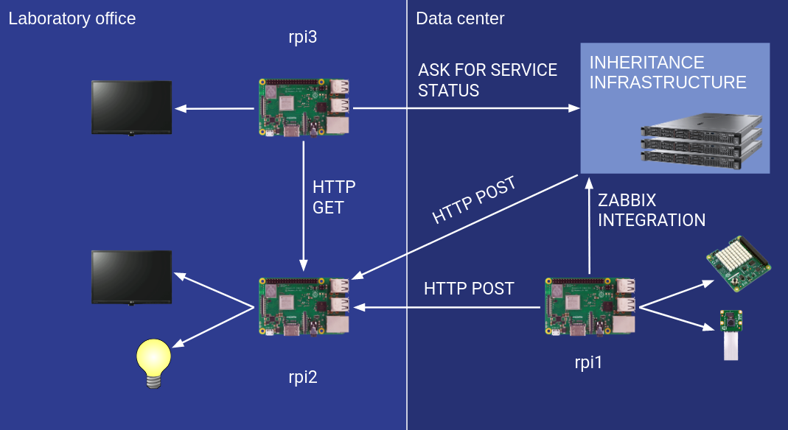
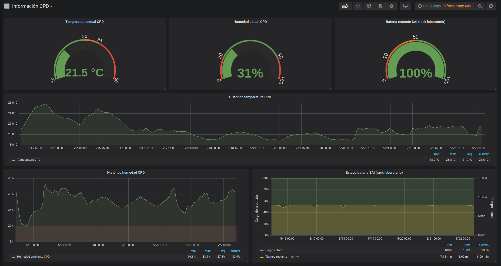
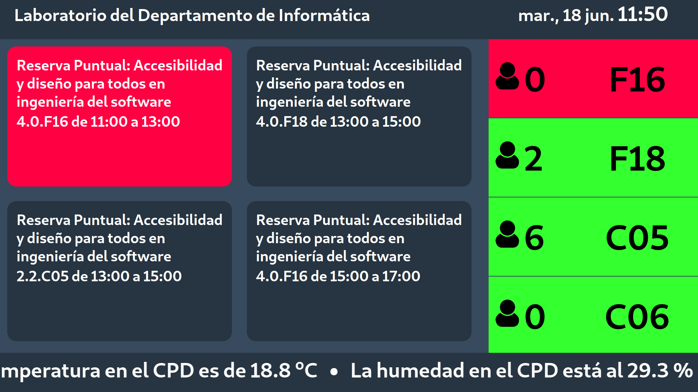
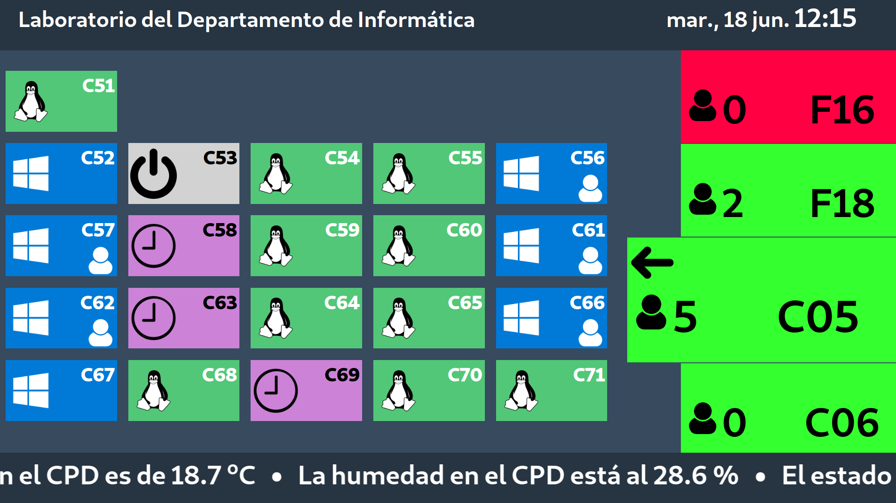
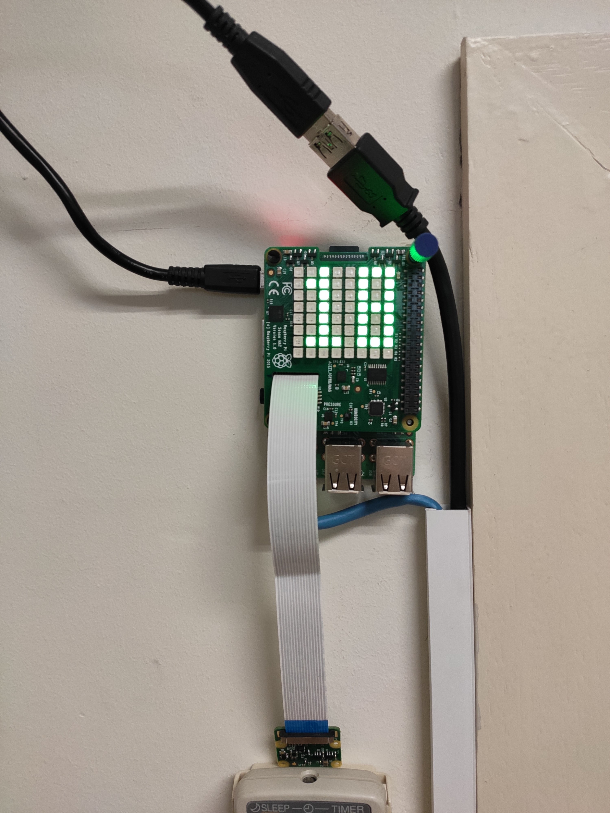
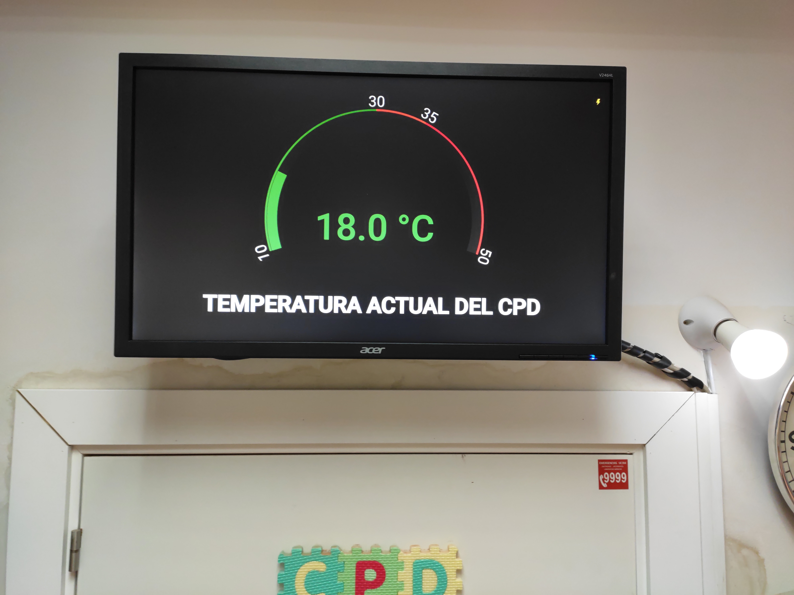
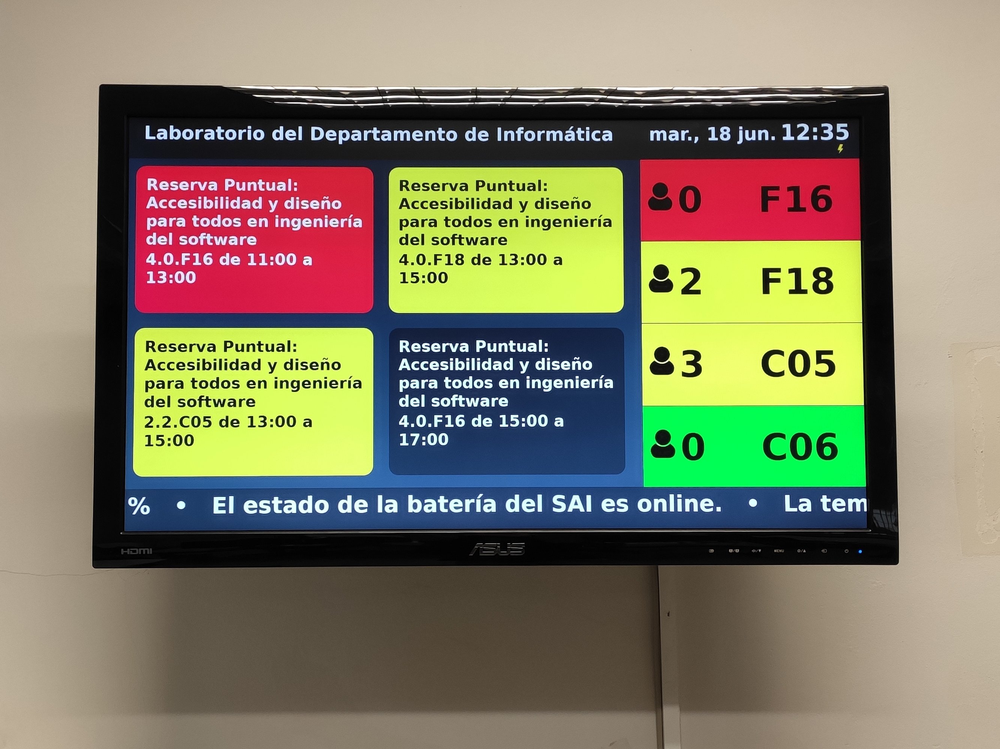

# Data center monitoring
This repository contains the implementation of my Bachelor's Degree Thesis, a system to monitor the status of the service of the laboratory of the Computer Engineering Department at my university (Universidad Carlos III de Madrid), with the aim to simplify the daily work at the laboratory.

My thesis report is written in Spanish under the title "Sistema de monitorización y alertas de estado para el laboratorio del Departamento de Informática". However, it contains a ten pages summary in English. My thesis and the summary can be found at [my university digital archive](https://e-archivo.uc3m.es) (login required) or [publicly on my web site](https://aalonso.eu/TFG/TFG_Aitor_Alonso_Nuñez.pdf).

**This work has obtained a grade of 10 with a distinction of Honor**, which makes me highly proud of it.

## What does the system do?
The laboratory of the Computer Engineering Department is in charge of maintain a data center with some servers and some computer classrooms. This system was defined to accomplish the following list of goals:

* **To monitor the data center** and server status: temperature, humidity, room light (switched on/off) and power supply.
* **To monitor the classrooms status** and the status of their computers: classroom reservations, classroom occupation, computer occupation, and computer status.
* To present all the system information in a way that should be **understandable and comprehensible at a glance.**
* **To alert the laboratory staff** of every unusual or strange situation and failures on the data center or the classrooms as soon as possible.

## System architecture
The system architecture is composed of the following elements:

* Three Raspberry Pi 3 model B+ computers.
* A SenseHat Raspberry Pi sensors module.
* A camera Raspberry Pi module.
* Two computer monitors.
* A Wi-Fi Philips &reg; Hue &trade; White and Color Ambiance light bulb.

The first raspberry (rpi1) is inside the data center and monitoring the room with the SenseHat and camera modules. It sends the information it gets to the inheritance infrastructure (an old Zabbix instance) and to the second raspberry (rpi2, which is in the laboratory office).

Rpi2 gets the data center monitoring data from rpi1 on an authenticated HTTP POST request to an API REST that is running on rpi2 (called rpi2_api). Rpi2 is connected to one monitor and the Wi-Fi light bulb. The monitor shows a Grafana instance that gets the data from Zabbix and shows the data center status in a kiosk mode. Rpi2_api controls the alerts and alarms the laboratory staff if there is something that they should attend to. When an alarm is fired, a siren sound plays on the monitor speakers and the Wi-Fi light bulb blinks on red.

Rpi3 has a custom light server written in Go, another API REST (called rpi3_api), and a web dashboard made with ReactJS and GatsbyJS. The web dashboard is shown on the monitor and it shows the classroom reservations for today, the classrooms occupation and the computers' status. All this information is retrieved from its own API REST, which asks the inheritance infrastructure for it. The API gets the classroom reservations with a web crawler from the laboratory web site, and the computers status and occupation from a remote command execution via SSH.

Here is a figure of the explained architecture:



## Repository architecture
This repository has the following architecture:
```
./
├─ images/
├─ install/
├─ rpi1/
|   └─ scripts/
├─ rpi2/
|   └─ API_REST/
├─ rpi3/
|   ├─ API_REST/
|   └─ GUI/
├─ config.json
└─ install.sh
```
Inside each folder and sub-folder, there is a README.md file that explains the contents of each and the files inside. There is a summary of what we can find in each folder:

* `images/` contais the images showed on this markdown document.
* `install/` contains the systemd daemons, scripts and other utilities used by the installation script `install.sh` to deploy the system.
* `rpi1/` contains the python3 scripts implemented to monitor the data center.
* `rpi2/`contains an API REST written in Go. This API controls the metrics from the data center and fires alarms when the temperature rises or the servers lose power supply.
* `rpi3/` contains another API REST written in Go and a web dashboard written in JavaScript (ReactJS + GatsbyJS). The API asks the inheritance infrastructure for the classrooms and computers status, and the web dashboard retrieves that information from the API and shows it.
* `config.json` contains the configuration values needed for the system with a JSON syntax.
* `install.sh` is a bash installation script. It should be launched on the raspberry that is intended to install. Before that, a non-privileged user must be created, who will run the system. That user can be changed in the script and it's `lab` by default.

## Some images of the system


<p align="center">Grafana dashboard</p><br/>


<p align="center">Rpi3 dashboard. Reservations view.</p><br/>


<p align="center">Rpi3 dashboard. Classroom view.</p><br/>


<p align="center">Rpi1 inside the data center.</p><br/>


<p align="center">Rpi2 monitor on the office.</p><br/>


<p align="center">Rpi3 monitor on the office.</p>